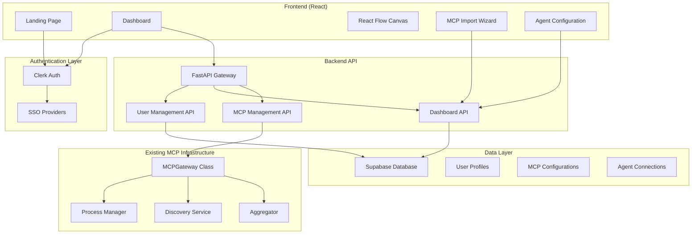

# Design Document

## Overview

The MCP Portal dashboard is a React-based SaaS interface for a **remote MCP hosting service**. Users connect their existing agents (Claude, Cursor, Kiro, etc.) to centrally managed MCP servers hosted on our platform. The dashboard will be built in `C:\Users\Joshc\source\repos\MCPportal\frontend` and will integrate with the existing FastAPI backend located at `c:\Users\Joshc\source\repos\MCPportal\mcp-portal`. 

**Core Value Proposition:**
- Users register their existing agents (not create new ones)
- Each agent gets a dedicated MCP stack configuration
- MCPs are hosted remotely and allocated per-agent
- Agents connect to their assigned MCP stack via unique endpoints
- Perfect for users with multiple agents needing different tool subsets

## Architecture

### High-Level Architecture



### Frontend Architecture

The React frontend will be structured as a modern SPA with the following key components:

- **Landing Page**: Marketing site with authentication and animated portal
- **Dashboard**: Main application interface with React Flow and left navigation
- **Component Library**: Reusable UI components with portal-themed design
- **Theme System**: Dark/light mode support with portal color scheme
- **State Management**: Context API for global state and theme management
- **API Layer**: Axios-based API client for backend communication

### Design System & Theming

**Color Palette (Based on Portal Logo):**
```css
/* Dark Mode (Default) */
--primary-blue: #4A90E2;
--secondary-blue: #357ABD;
--accent-blue: #6BB6FF;
--deep-blue: #1E3A8A;
--portal-glow: #87CEEB;
--background-dark: #0F172A;
--surface-dark: #1E293B;
--text-primary-dark: #F8FAFC;
--text-secondary-dark: #CBD5E1;

/* Light Mode */
--primary-blue-light: #2563EB;
--secondary-blue-light: #1D4ED8;
--accent-blue-light: #3B82F6;
--background-light: #FFFFFF;
--surface-light: #F8FAFC;
--text-primary-light: #0F172A;
--text-secondary-light: #475569;
```

**Portal Animation:**
- Subtle rotating SVG portal on landing page hero section
- Smooth CSS animations with `transform: rotate()` and gradient effects
- Particle effects around portal edges using CSS or lightweight animation library

### Backend Integration

The existing FastAPI backend at `c:\Users\Joshc\source\repos\MCPportal\mcp-portal` will be extended with new endpoints for:
- User management and authentication (integrating with Clerk)
- Dashboard-specific data operations (Supabase integration)
- MCP server CRUD operations for users (extending existing server management)
- Agent configuration management (new functionality)

**Existing Backend Components to Leverage:**
- **MCPGateway**: Core gateway functionality for server management
- **MCPDiscovery**: Server discovery and connection management
- **MCPAggregator**: Tool and resource aggregation
- **IDESettingsDiscovery**: Automatic MCP server detection from IDE configs
- **FastAPI Routes**: Existing API structure in `server_management.py`

## Portal Animation & Navigation Behavior

### Animated Portal Specifications
```css
/* Portal Animation Keyframes */
@keyframes portalSpin {
  from { transform: rotate(0deg); }
  to { transform: rotate(360deg); }
}

@keyframes portalGlow {
  0%, 100% { 
    filter: drop-shadow(0 0 20px rgba(74, 144, 226, 0.3));
  }
  50% { 
    filter: drop-shadow(0 0 30px rgba(74, 144, 226, 0.5));
  }
}

.portal-animation {
  animation: portalSpin 25s linear infinite, portalGlow 4s ease-in-out infinite;
  transform-origin: center;
}
```

### Navigation Behavior
- **Default View**: Hub (React Flow canvas) loads by default
- **Active States**: Current nav item highlighted with portal glow
- **Responsive**: Navigation collapses to icons only on mobile (<768px)
- **Persistence**: Last visited view remembered in localStorage
- **Breadcrumbs**: Show current location in top bar for nested views

### Theme System Implementation
```typescript
interface ThemeContextType {
  theme: 'dark' | 'light';
  toggleTheme: () => void;
  portalColors: {
    primary: string;
    secondary: string;
    accent: string;
    glow: string;
  };
}

// Default to dark mode on first visit
const defaultTheme = 'dark';
```

## Components and Interfaces

### Frontend Components

#### Core Layout Components
```typescript
// Landing Page Components
- LandingPage: Main marketing page with animated portal
- HeroSection: Portal animation and main CTA
- AuthSection: Clerk authentication integration
- FeatureShowcase: Platform benefits display
- AnimatedPortal: Spinning portal SVG component

// Dashboard Layout Components  
- Dashboard: Main application container with left nav
- LeftNavigation: Primary navigation sidebar
- MainContent: Content area for different views
- TopBar: User menu, theme toggle, notifications
- ThemeProvider: Dark/light mode context and controls

// Navigation Views
- HubView: Primary React Flow canvas for assigning MCPs to agent stacks (main interface)
- ServersView: Detailed MCP server management and configuration
- AgentsView: Register external agents and manage their MCP stack assignments
- StacksView: Manage MCP stacks (collections of MCPs per agent)
- SettingsView: User preferences and configuration
- AnalyticsView: Usage statistics and monitoring per agent/stack
- DocsView: Integration guides for connecting agents to MCP endpoints

// MCP Management Components
- MCPCard: Individual MCP server display with portal theme
- MCPImportModal: Multi-source import wizard
- MCPDetailsPanel: Server configuration and stats
- ServerStatusIndicator: Visual status with portal glow effects

// Agent Management Components
- AgentCard: Agent configuration display
- AgentCreationModal: New agent setup
- ConnectionManager: Visual connection controls
- AgentStatusPanel: Real-time agent monitoring

// Group Management Components
- GroupCard: MCP group display
- GroupCreationModal: Group setup interface
- GroupMembershipPanel: Group contents management

// Shared UI Components
- PortalButton: Themed button with subtle glow effects
- PortalCard: Card component with portal-inspired borders
- LoadingSpinner: Portal-themed loading animation
- ThemeToggle: Dark/light mode switcher
- NotificationToast: Portal-themed notifications
```

#### Left Navigation Structure
```typescript
interface NavigationItem {
  id: string;
  label: string;
  icon: React.ComponentType;
  path: string;
  badge?: number; // For notifications/counts
}

const navigationItems: NavigationItem[] = [
  {
    id: 'hub',
    label: 'Hub',
    icon: PortalIcon, // PRIMARY: Visual MCP stack assignment
    path: '/dashboard/hub',
    description: 'Main workspace for assigning MCPs to agent stacks'
  },
  {
    id: 'agents',
    label: 'My Agents',
    icon: BotIcon,
    path: '/dashboard/agents',
    description: 'Register external agents (Claude, Cursor, Kiro, etc.)'
  },
  {
    id: 'stacks',
    label: 'MCP Stacks',
    icon: LayersIcon,
    path: '/dashboard/stacks',
    description: 'Manage MCP collections assigned to each agent'
  },
  {
    id: 'servers',
    label: 'MCP Servers',
    icon: ServerIcon,
    path: '/dashboard/servers',
    description: 'Available MCP servers and their configurations'
  },
  {
    id: 'analytics',
    label: 'Analytics',
    icon: BarChartIcon,
    path: '/dashboard/analytics',
    description: 'Usage statistics per agent and MCP stack'
  },
  {
    id: 'marketplace',
    label: 'Marketplace',
    icon: ShoppingBagIcon,
    path: '/dashboard/marketplace',
    description: 'Browse and install MCPs from Smithery.ai'
  },
  {
    id: 'docs',
    label: 'Integration',
    icon: BookIcon,
    path: '/dashboard/docs',
    description: 'Guides for connecting agents to MCP endpoints'
  },
  {
    id: 'settings',
    label: 'Settings',
    icon: SettingsIcon,
    path: '/dashboard/settings',
    description: 'Account settings and billing'
  }
];

// Admin Navigation (separate for admin users)
const adminNavigationItems: NavigationItem[] = [
  {
    id: 'admin-dashboard',
    label: 'Admin Dashboard',
    icon: DashboardIcon,
    path: '/admin/dashboard',
    description: 'System overview and metrics'
  },
  {
    id: 'admin-users',
    label: 'User Management',
    icon: UsersIcon,
    path: '/admin/users',
    description: 'Manage user accounts and subscriptions'
  },
  {
    id: 'admin-billing',
    label: 'Billing & Plans',
    icon: CreditCardIcon,
    path: '/admin/billing',
    description: 'Subscription management and usage tracking'
  },
  {
    id: 'admin-system',
    label: 'System Health',
    icon: ActivityIcon,
    path: '/admin/system',
    description: 'Monitor MCP servers and resource usage'
  },
  {
    id: 'admin-support',
    label: 'Support Tools',
    icon: HelpCircleIcon,
    path: '/admin/support',
    description: 'User troubleshooting and configuration tools'
  }
];

// Updated Navigation Purposes:
// - Hub: PRIMARY interface for assigning MCPs to agent stacks
// - My Agents: Register external agents (Claude, Cursor, Kiro, etc.)
// - MCP Stacks: Manage collections of MCPs per agent
// - MCP Servers: Browse available MCPs to add to stacks
// - Analytics: Monitor usage per agent/stack
// - Integration: Help users connect their agents to endpoints
```

#### React Flow Integration
```typescript
// Node Types
interface MCPNode {
  id: string;
  type: 'mcp-server';
  data: {
    name: string;
    status: 'connected' | 'disconnected' | 'error';
    toolCount: number;
    source: string;
  };
  position: { x: number; y: number };
}

interface AgentNode {
  id: string;
  type: 'agent';
  data: {
    name: string;
    description: string;
    connectedMCPs: string[];
    connectedGroups: string[];
  };
  position: { x: number; y: number };
}

interface GroupNode {
  id: string;
  type: 'mcp-group';
  data: {
    name: string;
    mcpServers: string[];
    description: string;
  };
  position: { x: number; y: number };
}

// Edge Types
interface ConnectionEdge {
  id: string;
  source: string;
  target: string;
  type: 'connection';
  data: {
    connectionType: 'agent-to-mcp' | 'agent-to-group';
    status: 'active' | 'inactive';
  };
}
```

### Backend API Extensions

#### New API Endpoints
```python
# User Management
@router.post("/api/v1/users/profile")
async def create_user_profile(user_data: UserProfile)

@router.get("/api/v1/users/profile")
async def get_user_profile(user_id: str)

# Dashboard Data
@router.get("/api/v1/dashboard/layout")
async def get_dashboard_layout(user_id: str)

@router.post("/api/v1/dashboard/layout")
async def save_dashboard_layout(user_id: str, layout: DashboardLayout)

# MCP Management
@router.post("/api/v1/mcps/import")
async def import_mcp_server(user_id: str, import_data: MCPImportRequest)

@router.delete("/api/v1/mcps/{mcp_id}")
async def remove_mcp_server(user_id: str, mcp_id: str)

# Agent Management
@router.post("/api/v1/agents")
async def create_agent(user_id: str, agent_data: AgentConfig)

@router.put("/api/v1/agents/{agent_id}/connections")
async def update_agent_connections(user_id: str, agent_id: str, connections: List[str])

# Group Management
@router.post("/api/v1/groups")
async def create_mcp_group(user_id: str, group_data: MCPGroupConfig)

@router.put("/api/v1/groups/{group_id}/members")
async def update_group_members(user_id: str, group_id: str, members: List[str])
```

#### Integration with Existing Gateway
The design leverages the existing MCP infrastructure from `mcp-portal` directory:

```python
# Located in: c:\Users\Joshc\source\repos\MCPportal\mcp-portal\mcp_gateway\core\gateway.py
class DashboardGateway(MCPGateway):
    """Extended gateway with dashboard-specific functionality."""
    
    def __init__(self, settings: Settings, db_client: SupabaseClient):
        super().__init__(settings)
        self.db = db_client
        
    async def import_mcp_from_source(self, user_id: str, source: str, config: dict):
        """Import MCP server from external source."""
        # Implementation for Smithery.ai, GitHub, custom upload
        # Integrates with existing IDESettingsDiscovery class
        
    async def create_user_agent(self, user_id: str, agent_config: AgentConfig):
        """Create new agent configuration for user."""
        # Store in database and update gateway state
        # Uses existing MCPGateway.toggle_server() functionality
        
    async def update_agent_connections(self, user_id: str, agent_id: str, connections: List[str]):
        """Update agent's MCP connections."""
        # Update database and refresh gateway aggregation
        # Leverages existing MCPAggregator for tool/resource management
```

**Key Integration Points:**
- **MCPGateway Class**: Extends existing gateway functionality from `mcp_gateway/core/gateway.py`
- **IDESettingsDiscovery**: Uses existing discovery service from `mcp_gateway/config/settings_discovery.py`
- **MCPAggregator**: Leverages existing aggregation logic from `mcp_gateway/core/aggregator.py`
- **FastAPI Routes**: Extends existing API routes from `mcp_gateway/api/server_management.py`

## Data Models

### Supabase Database Schema

```sql
-- Users table (managed by Clerk)
CREATE TABLE users (
    id UUID PRIMARY KEY DEFAULT gen_random_uuid(),
    clerk_user_id VARCHAR UNIQUE NOT NULL,
    email VARCHAR NOT NULL,
    created_at TIMESTAMP DEFAULT NOW(),
    updated_at TIMESTAMP DEFAULT NOW()
);

-- MCP Servers table
CREATE TABLE mcp_servers (
    id UUID PRIMARY KEY DEFAULT gen_random_uuid(),
    user_id UUID REFERENCES users(id) ON DELETE CASCADE,
    name VARCHAR NOT NULL,
    source VARCHAR NOT NULL, -- 'smithery', 'github', 'custom', 'imported'
    config JSONB NOT NULL,
    status VARCHAR DEFAULT 'disconnected',
    position JSONB, -- React Flow position
    created_at TIMESTAMP DEFAULT NOW(),
    updated_at TIMESTAMP DEFAULT NOW()
);

-- Registered Agents table (External agents like Claude, Cursor, etc.)
CREATE TABLE registered_agents (
    id UUID PRIMARY KEY DEFAULT gen_random_uuid(),
    user_id UUID REFERENCES users(id) ON DELETE CASCADE,
    name VARCHAR NOT NULL, -- "My Claude Desktop", "Cursor Agent"
    type VARCHAR NOT NULL, -- 'claude', 'cursor', 'kiro', 'custom'
    description TEXT,
    endpoint VARCHAR UNIQUE NOT NULL, -- Unique MCP endpoint URL
    api_key VARCHAR UNIQUE NOT NULL, -- Authentication key
    status VARCHAR DEFAULT 'inactive', -- 'active', 'inactive', 'connecting'
    last_connected TIMESTAMP,
    position JSONB, -- React Flow position
    created_at TIMESTAMP DEFAULT NOW(),
    updated_at TIMESTAMP DEFAULT NOW()
);

-- MCP Stacks table (Collections of MCPs per agent)
CREATE TABLE mcp_stacks (
    id UUID PRIMARY KEY DEFAULT gen_random_uuid(),
    user_id UUID REFERENCES users(id) ON DELETE CASCADE,
    agent_id UUID REFERENCES registered_agents(id) ON DELETE CASCADE,
    name VARCHAR NOT NULL, -- "Claude Code Stack"
    endpoint VARCHAR UNIQUE NOT NULL, -- Stack-specific endpoint
    status VARCHAR DEFAULT 'stopped', -- 'running', 'stopped', 'error'
    resource_limits JSONB, -- CPU, memory, connection limits
    position JSONB, -- React Flow position
    created_at TIMESTAMP DEFAULT NOW(),
    updated_at TIMESTAMP DEFAULT NOW(),
    UNIQUE(agent_id) -- One stack per agent
);

-- MCP Groups table
CREATE TABLE mcp_groups (
    id UUID PRIMARY KEY DEFAULT gen_random_uuid(),
    user_id UUID REFERENCES users(id) ON DELETE CASCADE,
    name VARCHAR NOT NULL,
    description TEXT,
    position JSONB, -- React Flow position
    created_at TIMESTAMP DEFAULT NOW(),
    updated_at TIMESTAMP DEFAULT NOW()
);

-- Group Members table
CREATE TABLE group_members (
    id UUID PRIMARY KEY DEFAULT gen_random_uuid(),
    group_id UUID REFERENCES mcp_groups(id) ON DELETE CASCADE,
    mcp_server_id UUID REFERENCES mcp_servers(id) ON DELETE CASCADE,
    created_at TIMESTAMP DEFAULT NOW(),
    UNIQUE(group_id, mcp_server_id)
);

-- Stack MCP Assignments table (Which MCPs are in each stack)
CREATE TABLE stack_mcp_assignments (
    id UUID PRIMARY KEY DEFAULT gen_random_uuid(),
    stack_id UUID REFERENCES mcp_stacks(id) ON DELETE CASCADE,
    mcp_server_id UUID REFERENCES mcp_servers(id) ON DELETE CASCADE,
    priority INTEGER DEFAULT 0, -- Loading order within stack
    created_at TIMESTAMP DEFAULT NOW(),
    UNIQUE(stack_id, mcp_server_id)
);

-- Agent Connection Logs table (Track when agents connect)
CREATE TABLE agent_connection_logs (
    id UUID PRIMARY KEY DEFAULT gen_random_uuid(),
    agent_id UUID REFERENCES registered_agents(id) ON DELETE CASCADE,
    stack_id UUID REFERENCES mcp_stacks(id) ON DELETE CASCADE,
    connection_type VARCHAR NOT NULL, -- 'connect', 'disconnect', 'error'
    ip_address INET,
    user_agent TEXT,
    created_at TIMESTAMP DEFAULT NOW()
);

-- Dashboard Layouts table
CREATE TABLE dashboard_layouts (
    id UUID PRIMARY KEY DEFAULT gen_random_uuid(),
    user_id UUID REFERENCES users(id) ON DELETE CASCADE,
    layout_data JSONB NOT NULL,
    created_at TIMESTAMP DEFAULT NOW(),
    updated_at TIMESTAMP DEFAULT NOW(),
    UNIQUE(user_id)
);
```

### TypeScript Data Models

```typescript
// User Models
interface UserProfile {
  id: string;
  clerkUserId: string;
  email: string;
  createdAt: string;
  updatedAt: string;
}

// MCP Models
interface MCPServer {
  id: string;
  userId: string;
  name: string;
  source: 'smithery' | 'github' | 'custom' | 'imported';
  config: MCPServerConfig;
  status: 'connected' | 'disconnected' | 'error';
  position: { x: number; y: number };
  createdAt: string;
  updatedAt: string;
}

interface MCPServerConfig {
  command?: string;
  url?: string;
  args?: string[];
  env?: Record<string, string>;
  enabled: boolean;
}

// Agent Registration Models (External Agents)
interface RegisteredAgent {
  id: string;
  userId: string;
  name: string; // e.g., "My Claude Desktop", "Cursor Agent", "Kiro Assistant"
  type: 'claude' | 'cursor' | 'kiro' | 'custom'; // Agent platform
  description: string;
  endpoint: string; // Unique MCP endpoint for this agent
  apiKey: string; // Authentication key for agent to connect
  mcpStackId: string; // Reference to assigned MCP stack
  position: { x: number; y: number };
  status: 'active' | 'inactive' | 'connecting';
  lastConnected: string;
  createdAt: string;
  updatedAt: string;
}

// MCP Stack Models (Per-Agent MCP Collections)
interface MCPStack {
  id: string;
  userId: string;
  agentId: string; // Which agent this stack belongs to
  name: string; // e.g., "Claude Code Stack", "Cursor Development Stack"
  mcpServers: string[]; // Array of MCP server IDs
  endpoint: string; // Unique endpoint URL for this stack
  status: 'running' | 'stopped' | 'error';
  resourceLimits: {
    maxConcurrentConnections: number;
    memoryLimit: string;
    cpuLimit: string;
  };
  createdAt: string;
  updatedAt: string;
}

// Group Models
interface MCPGroup {
  id: string;
  userId: string;
  name: string;
  description: string;
  position: { x: number; y: number };
  members: MCPServer[];
  createdAt: string;
  updatedAt: string;
}

// Connection Models
interface AgentConnection {
  id: string;
  agentId: string;
  targetId: string;
  targetType: 'mcp_server' | 'mcp_group';
  createdAt: string;
}

// Dashboard Models
interface DashboardLayout {
  userId: string;
  nodes: (MCPNode | AgentNode | GroupNode)[];
  edges: ConnectionEdge[];
  viewport: { x: number; y: number; zoom: number };
}
```

## Error Handling

### Frontend Error Handling
- Global error boundary for React components
- Toast notifications for user feedback
- Retry mechanisms for API calls
- Graceful degradation for offline scenarios

### Backend Error Handling
- Comprehensive error responses with user-friendly messages
- Database transaction rollbacks for data consistency
- Logging integration with existing gateway logging
- Rate limiting and abuse prevention

### Authentication Error Handling
- Clerk session validation
- Automatic token refresh
- Secure logout and session cleanup
- SSO provider error handling

## Testing Strategy

### Frontend Testing
- **Unit Tests**: Jest + React Testing Library for components
- **Integration Tests**: API integration testing with MSW
- **E2E Tests**: Playwright for critical user flows
- **Visual Tests**: Storybook for component documentation

### Backend Testing
- **Unit Tests**: Pytest for new API endpoints
- **Integration Tests**: Database integration testing
- **API Tests**: FastAPI test client for endpoint validation
- **Performance Tests**: Load testing for dashboard operations

### Authentication Testing
- Clerk webhook testing
- SSO provider integration testing
- Session management testing
- Security vulnerability testing

## Deployment and Infrastructure

### UI/UX Design Specifications

#### Landing Page Design
- **Hero Section**: Large animated portal SVG (similar to logo) with subtle rotation
- **Portal Animation**: 
  - Continuous slow rotation (360° in 20-30 seconds)
  - Subtle glow effects using CSS box-shadow and gradients
  - Particle effects around portal rim (optional, lightweight)
- **Typography**: Clean, modern font (Inter or similar) with portal blue accents
- **Layout**: Centered hero with portal on right, content on left
- **CTA Buttons**: Portal-themed with subtle glow on hover

#### Dashboard Layout
- **Left Navigation**: Fixed sidebar (280px width) with portal-themed styling
- **Navigation Items**: Icons with labels, active state with portal glow
- **Main Content**: Flexible area (calc(100vw - 280px)) for different views
- **Top Bar**: User avatar, theme toggle, notifications (48px height)
- **Hub Interface**: Primary connection workspace with React Flow canvas
- **Add Button**: "+" button in top-right corner of Hub for quick MCP import
- **Theme Toggle**: Smooth transition between dark/light modes

#### Hub Interface Design (Primary View)
- **React Flow Canvas**: Main workspace for visual MCP stack assignment
- **Agent Nodes**: Registered external agents (Claude, Cursor, Kiro, etc.)
- **MCP Stack Nodes**: Collections of MCPs assigned to each agent
- **MCP Server Nodes**: Individual MCP servers available for assignment
- **Connection Lines**: Visual edges showing agent → stack → MCP relationships
- **Add MCP Button**: "+" in top-right corner opens MCP selection modal
- **Stack Management**: Drag MCPs into/out of agent stacks
- **Endpoint Display**: Show unique connection URLs for each agent
- **Status Indicators**: Real-time connection status per agent
- **Mini-map**: Small overview of entire canvas in bottom-right

#### Agent Registration & Stack Assignment Flow
```typescript
// 1. User registers their external agent
interface AgentRegistration {
  name: string; // "My Claude Desktop"
  type: 'claude' | 'cursor' | 'kiro' | 'custom';
  description: string;
}

// 2. System creates dedicated MCP stack and endpoint
interface MCPStackCreation {
  agentId: string;
  stackName: string; // Auto-generated: "{agentName} Stack"
  endpoint: string; // "https://mcp.portal.com/stacks/{stackId}"
  apiKey: string; // For agent authentication
}

// 3. User assigns MCPs to the stack
interface MCPAssignment {
  stackId: string;
  mcpServerId: string;
  priority: number; // Order of MCP loading
}
```

#### MCP Selection Modal (Triggered by "+" Button)
```typescript
interface MCPSelectionModal {
  categories: {
    smithery: MCPServer[]; // From Smithery.ai API
    github: MCPServer[];   // From GitHub repositories
    custom: MCPServer[];   // User uploaded
    templates: MCPServer[]; // Pre-configured templates
  };
  searchFilter: string;
  sourceFilter: 'all' | 'smithery' | 'github' | 'custom' | 'templates';
  onSelect: (mcp: MCPServer) => void;
  onImport: (source: string, config: any) => void;
}
```

#### Component Styling
- **Cards**: Subtle border with portal blue accent, rounded corners
- **Buttons**: Primary buttons with portal gradient, secondary with outline
- **Form Elements**: Portal blue focus states, consistent with theme
- **Status Indicators**: Color-coded with portal theme (blue = active, gray = inactive)
- **Animations**: Subtle hover effects, smooth transitions (200-300ms)

### Pricing Tiers & Resource Limits

#### Starter Plan - $15/mo (7-day free trial)
- **Up to 5 registered agents** (Claude, Cursor, Kiro, etc.)
- **Up to 15 MCP servers** total across all agents
- **Resource limits**: 2GB RAM, 1 CPU core shared
- **Community support** (Discord/forums)
- **Basic analytics** (connection logs, uptime)

#### Pro Plan - $40/mo
- **Up to 15 registered agents**
- **Up to 50 MCP servers** total
- **Enhanced resources**: 8GB RAM, 4 CPU cores
- **Priority support** (email, faster response)
- **Advanced analytics** (usage metrics, performance insights)
- **MCP templates** (save/share configurations)
- **API access** for automation

#### Enterprise Plan - Custom pricing
- **Unlimited agents and MCPs**
- **Dedicated resources** (custom allocation)
- **SLA guarantees** (99.9% uptime)
- **White-label options**
- **SSO integration** (SAML, LDAP)
- **Dedicated support** (Slack channel, phone)
- **Custom integrations**
- **Multi-region deployment**

### Recommended Hosting Architecture (Cost-Optimized)

#### **Primary Recommendation: DigitalOcean + Hetzner Hybrid**

**Frontend & API (DigitalOcean):**
- **App Platform**: $12/mo for frontend (auto-scaling, CDN included)
- **Managed Database**: $15/mo for PostgreSQL (Supabase alternative)
- **Load Balancer**: $12/mo for high availability

**MCP Runtime (Hetzner - Much cheaper compute):**
- **Dedicated servers**: €39/mo (~$42) for 8-core/32GB (vs $160+ on AWS)
- **Docker Swarm**: Container orchestration for MCP isolation
- **Per-user resource allocation**: cgroups for CPU/memory limits

**Estimated Monthly Costs:**
- **Infrastructure**: ~$80/mo base (supports 100+ users)
- **Supabase**: $25/mo (database + auth)
- **Clerk**: $25/mo (authentication)
- **Stripe**: 2.9% + 30¢ per transaction
- **Total**: ~$130/mo base + transaction fees

**Cost per user at scale:**
- 100 users: $1.30/user/mo infrastructure cost
- 500 users: $0.26/user/mo infrastructure cost
- Healthy margins on all plans!

#### **Alternative: Full AWS (Higher cost, easier scaling)**
- **ECS Fargate**: $50-100/mo base
- **RDS**: $30-50/mo
- **ALB**: $20/mo
- **Total**: ~$150-200/mo base (2-3x more expensive)

**Recommendation**: Start with DigitalOcean + Hetzner for cost efficiency, migrate to AWS later if needed for enterprise features.

### Frontend Deployment
- Build process: Vite for fast development and optimized builds
- Static hosting: DigitalOcean App Platform or Vercel for frontend deployment
- Environment configuration: Separate configs for dev/staging/prod
- CDN integration: Asset optimization and global distribution
- Theme persistence: localStorage for user theme preference

### Backend Integration
- Extend existing FastAPI application
- Database migrations: Supabase migration scripts
- Environment variables: Clerk and Supabase configuration
- Docker integration: Update existing Docker setup

### Monitoring and Analytics
- User analytics: Track dashboard usage patterns
- Performance monitoring: Frontend and API performance metrics
- Error tracking: Sentry integration for error monitoring
- Usage metrics: MCP server usage and connection analytics