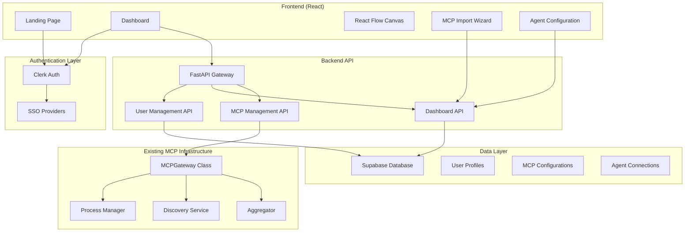

# MCP Portal Project Overview

This document provides a comprehensive overview of the MCP Portal project, including its purpose, architecture, features, and implementation plan. It is intended to be a central reference for the development team.

## 1. Introduction

The MCP Portal is a SaaS platform that provides a beautiful, modern, and intuitive React-based interface for managing remote MCP (Multi-Context Prompt) hosting. The core idea is to allow users to connect their existing AI agents (like Claude, Cursor, Kiro, etc.) to centrally managed and hosted MCP servers. Users do not create new agents on the platform; instead, they register their external agents and configure which MCPs each agent can access remotely. This provides a powerful way to manage toolsets and capabilities for multiple agents from a single dashboard.

## 2. Core Concepts

- **Remote MCP Hosting**: The platform hosts MCP server stacks remotely, allocating dedicated resources for each user's agents.
- **Agent Registration**: Users register their existing, external AI agents with the portal.
- **MCP Stacks**: For each registered agent, a dedicated "MCP Stack" is created. This is a collection of MCP servers that the agent is authorized to use.
- **Unique Endpoints**: Each agent stack is assigned a unique endpoint URL and API key, which is used to configure the agent to communicate with its designated MCPs.
- **Visual Management**: A primary goal is to provide a visual, intuitive interface (using React Flow) for managing the relationships between agents, stacks, and MCP servers.

## 3. Architecture

The system is composed of a React frontend, a FastAPI backend, and integrations with third-party services like Clerk for authentication and Supabase for the database.

### High-Level Architecture



### Frontend Architecture

The frontend is a modern Single Page Application (SPA) built with React and Vite. Key architectural aspects include:
- **Component-Based:** Built with reusable React components, leveraging shadcn/ui and custom components.
- **State Management:** Utilizes React's Context API for global state, such as theme and authentication status.
- **Routing:** Uses `react-router-dom` for client-side routing.
- **Styling:** Styled with Tailwind CSS, with a custom "portal" theme.
- **API Communication:** Uses an Axios-based client for communicating with the backend.

## 4. Tech Stack

- **Frontend:**
  - **Framework/Library:** React 19, Vite
  - **Language:** TypeScript
  - **Styling:** Tailwind CSS, `tailwindcss-animate`
  - **UI Components:** shadcn/ui, Radix UI primitives, custom components
  - **Data Visualization:** React Flow (`@xyflow/react`), Recharts
  - **Routing:** React Router (`react-router-dom`)
  - **State Management:** React Context
  - **API Client:** Axios
- **Backend:**
  - **Framework:** FastAPI (Python)
  - **Database:** Supabase (PostgreSQL)
- **Authentication:**
  - **Provider:** Clerk (supports Google, GitHub SSO)
- **Development & Tooling:**
  - **Linting:** ESLint
  - **Formatting:** Prettier
  - **Package Manager:** npm
  - **Containerization:** Docker

## 5. Project Structure

The project is a monorepo with the frontend and backend code organized in separate directories.

```
/
├── frontend/         # React frontend application
│   ├── src/
│   │   ├── components/ # Reusable UI components
│   │   ├── contexts/   # React context providers (Auth, Theme)
│   │   ├── hooks/      # Custom React hooks
│   │   ├── pages/      # Top-level page components
│   │   ├── router/     # Application routing setup
│   │   └── App.tsx     # Main application component
│   ├── tailwind.config.js
│   └── vite.config.ts
├── mcp_gateway/      # FastAPI backend application
│   ├── api/          # API routes and endpoints
│   ├── core/         # Core business logic
│   └── models/       # Pydantic data models
├── .gemini/          # Project planning documents
│   ├── design.md
│   ├── requirements.md
│   └── tasks.md
└── ...
```

## 6. Key Features & Requirements

The platform's functionality is defined by the following core user stories:
- **Visual Dashboard:** Users can view and manage their MCP servers on a visual dashboard.
- **Multi-Source Import:** Users can import MCPs from Smithery.ai, GitHub, or custom uploads.
- **Agent Registration & Stack Assignment:** Users can register external agents and visually assign MCP stacks to them.
- **Reusable Templates:** Users can create reusable templates of MCP collections.
- **Visual Connection Management:** Users can create and manage connections between agents and stacks in the React Flow interface.
- **Remote Agent Connection:** External agents can connect to their assigned MCP stacks via unique, secure endpoints.
- **Landing Page & Auth:** A professional landing page with Clerk-powered authentication (Google/GitHub SSO).
- **Data Persistence:** All user data is reliably stored and synced with a Supabase database.
- **Pricing Tiers:** The platform offers different subscription plans (Starter, Pro, Enterprise) with varying limits.
- **Admin Panel:** An administrative interface for user management, system health monitoring, and billing.

## 7. UI Design and Components

The UI is designed to be modern, minimalistic, and visually appealing, with a "portal" theme characterized by a blue color palette, glow effects, and subtle animations.

### Design System
- **Color Palette:** A primary blue (`#4A90E2` in dark mode) with accents and a deep charcoal background (`#0F172A`).
- **Theming:** Supports both dark (default) and light modes.
- **Typography:** `Inter` for general text and `JetBrains Mono` for code/monospace text.
- **Animations:** Subtle animations like a spinning portal icon, glow effects, and smooth transitions are used to enhance the user experience.

### Core Components
The frontend is built using a combination of custom components and components from the shadcn/ui library. Key components include:
- **`App.tsx`**: The main entry point for the dashboard application, which sets up the layout and routing.
- **`Portal-Sidebar.tsx`**: A custom, feature-rich sidebar for navigation.
- **`Header.tsx`**: A custom header component with search and user controls.
- **`HubView.tsx`**: The central view of the dashboard, containing the React Flow canvas for visual management.
- **Custom Nodes (`HubView.tsx`)**: Custom nodes for React Flow to represent Agents, MCP Stacks, and MCP Servers.
- **UI Primitives (`/components/ui`)**: A comprehensive set of base components like `Button`, `Card`, `Input`, `Badge`, `Select`, etc., which are styled to match the portal theme.

## 8. Implementation Plan

The project is being developed following a detailed implementation plan, broken down into major phases:
1.  **Project Foundation:** Setup React project, dependencies, and theme system.
2.  **Authentication:** Implement Clerk for user sign-up, sign-in, and session management.
3.  **Landing Page:** Build the public-facing marketing and login page.
4.  **Dashboard Layout:** Create the main dashboard shell, including sidebar and header.
5.  **Agent & MCP Management:** Implement features for registering agents and importing MCPs.
6.  **React Flow Hub:** Develop the core visual interface for connecting agents to MCPs.
7.  **Backend & Database:** Extend the FastAPI backend and set up the Supabase schema.
8.  **Billing & Admin:** Integrate Stripe for subscriptions and build an admin panel.
9.  **Testing & Deployment:** Implement comprehensive testing and deploy the application.

## 9. Data Models

The application uses a PostgreSQL database managed by Supabase. The schema is designed to support the core concepts of users, agents, MCPs, and their relationships.

### Database Schema Highlights
- `users`: Stores user profile information, linked to Clerk for authentication.
- `registered_agents`: Contains information about users' external agents.
- `mcp_servers`: Stores configurations for all imported MCP servers.
- `mcp_stacks`: Represents the collection of MCPs assigned to a specific agent.
- `stack_mcp_assignments`: A join table linking MCPs to stacks.

### TypeScript Models
The frontend uses a set of TypeScript interfaces (defined in `src/types/index.ts`) that mirror the database schema to ensure type safety.

## 10. Deployment

The recommended deployment strategy is a cost-optimized hybrid cloud approach:
- **Frontend & API (DigitalOcean):** The React frontend and FastAPI backend are hosted on DigitalOcean's App Platform for ease of use and auto-scaling.
- **MCP Runtime (Hetzner):** The actual MCP processes are run on cheaper, powerful dedicated servers from Hetzner to manage costs effectively.
- **Containerization:** Docker is used to containerize and isolate MCP server processes.
